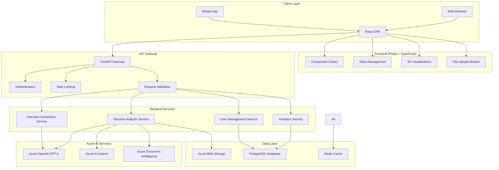
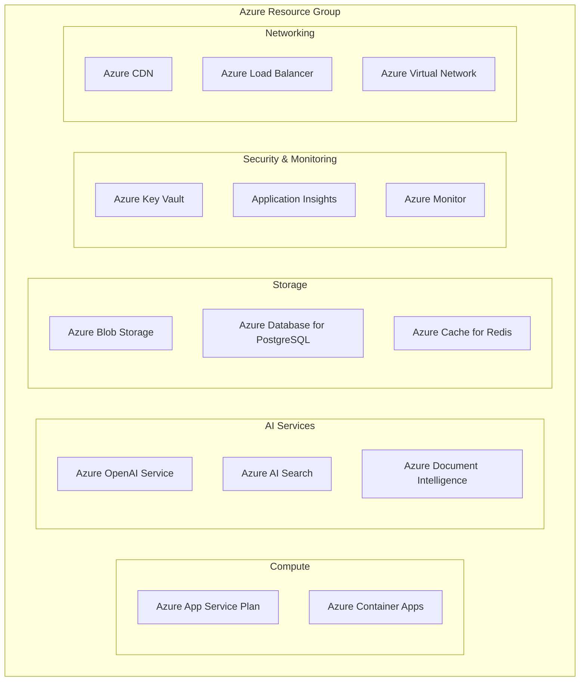
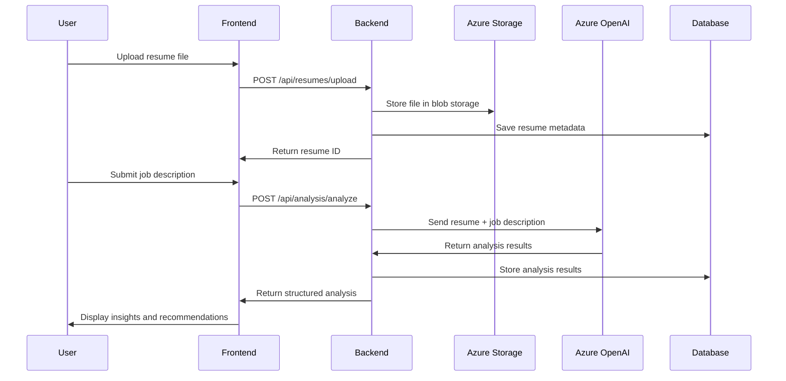
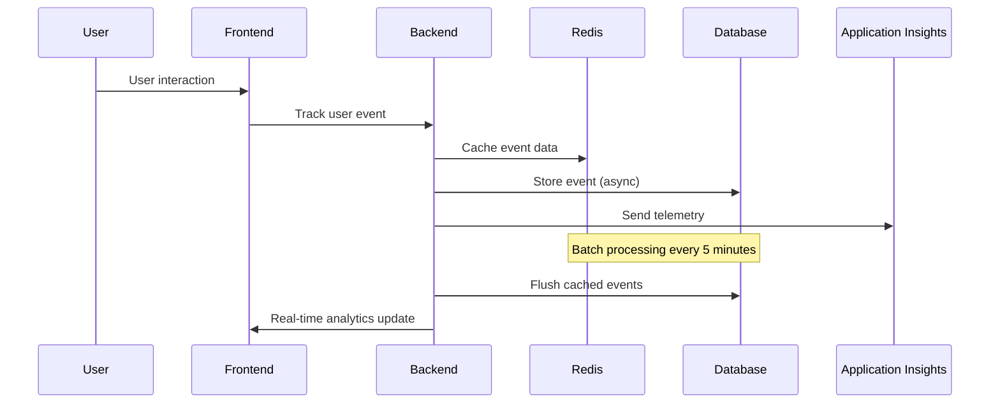
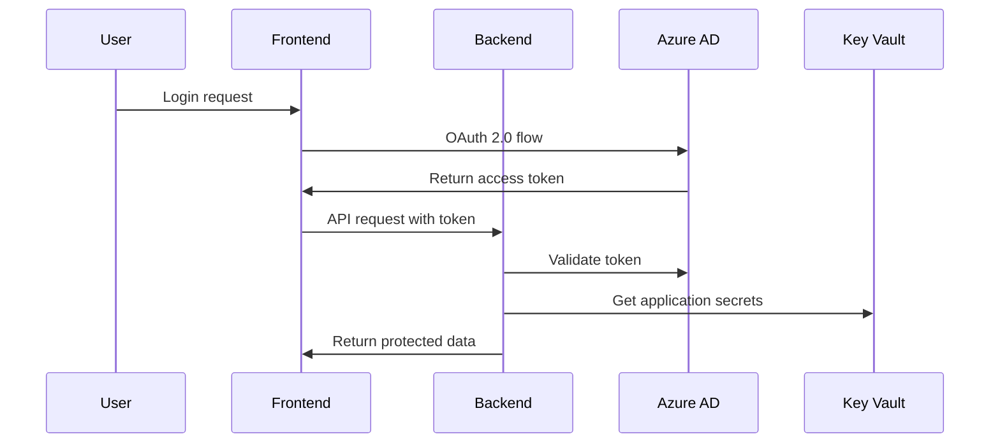

# 🏗️ Architecture Guide

Technical deep dive into AI Career Navigator's system design and architecture.

## 🎯 System Overview

AI Career Navigator is a modern, cloud-native application built with microservices architecture, leveraging Azure AI services for intelligent career guidance.

### High-Level Architecture



## 🔧 Frontend Architecture

### Technology Stack

| Component | Technology | Purpose |
|-----------|------------|---------|
| **Framework** | React 18 | Component-based UI with concurrent features |
| **Language** | TypeScript 5.6+ | Type safety and developer experience |
| **Build Tool** | Vite 5.4+ | Fast development and optimized builds |
| **Styling** | Tailwind CSS 3.4+ | Utility-first CSS framework |
| **State Management** | Zustand | Lightweight state management |
| **Routing** | React Router 6+ | Client-side routing |
| **3D Graphics** | Three.js + React Three Fiber | Interactive 3D visualizations |
| **Animations** | Framer Motion | Smooth animations and transitions |
| **Forms** | React Hook Form | Performant form handling |
| **HTTP Client** | Axios | API communication |

### Component Architecture

```
src/
├── components/           # Reusable UI components
│   ├── ui/              # Basic UI primitives
│   ├── forms/           # Form components
│   ├── charts/          # Data visualization
│   └── 3d/              # Three.js components
├── pages/               # Route components
├── hooks/               # Custom React hooks
├── store/               # Zustand stores
├── services/            # API service layer
├── utils/               # Utility functions
├── types/               # TypeScript definitions
└── assets/              # Static assets
```

### State Management Pattern

```typescript
// Example: Resume Analysis Store
interface ResumeStore {
  // State
  currentResume: Resume | null;
  analysis: AnalysisResult | null;
  isAnalyzing: boolean;
  
  // Actions
  uploadResume: (file: File) => Promise<void>;
  analyzeResume: (jobDescription: string) => Promise<void>;
  clearAnalysis: () => void;
}

const useResumeStore = create<ResumeStore>((set, get) => ({
  currentResume: null,
  analysis: null,
  isAnalyzing: false,
  
  uploadResume: async (file) => {
    set({ isAnalyzing: true });
    try {
      const resume = await resumeService.upload(file);
      set({ currentResume: resume, isAnalyzing: false });
    } catch (error) {
      set({ isAnalyzing: false });
      throw error;
    }
  },
  
  // ... other actions
}));
```

## ⚙️ Backend Architecture

### Technology Stack

| Component | Technology | Purpose |
|-----------|------------|---------|
| **Framework** | FastAPI | Modern Python web framework |
| **Language** | Python 3.11+ | High-performance async backend |
| **ASGI Server** | Uvicorn | Production ASGI server |
| **ORM** | SQLAlchemy 2.0+ | Database abstraction layer |
| **Database** | PostgreSQL | Primary data storage |
| **Cache** | Redis | Session and data caching |
| **File Storage** | Azure Blob Storage | Resume and document storage |
| **AI Services** | Azure OpenAI | GPT-4 for analysis and insights |
| **Search** | Azure AI Search | Semantic document search |
| **Validation** | Pydantic | Data validation and serialization |

### Service Architecture

```
backend/
├── api/                 # API route handlers
│   ├── auth/           # Authentication endpoints
│   ├── resumes/        # Resume management
│   ├── analysis/       # AI analysis endpoints
│   └── interviews/     # Interview generation
├── services/            # Business logic layer
│   ├── resume_service.py
│   ├── analysis_service.py
│   └── interview_service.py
├── models/              # Database models
├── schemas/             # Pydantic schemas
├── core/                # Core utilities
│   ├── config.py       # Configuration
│   ├── security.py     # Authentication
│   └── database.py     # Database setup
└── approaches/          # AI prompt strategies
    ├── prompts/         # AI prompts
    └── processors/      # Document processors
```

### AI Integration Pattern

```python
# Resume Analysis Service
class ResumeAnalysisService:
    def __init__(self, openai_client: AzureOpenAI):
        self.openai_client = openai_client
        self.prompt_manager = PromptManager()
    
    async def analyze_resume(
        self, 
        resume_content: str, 
        job_description: str
    ) -> AnalysisResult:
        # 1. Prepare analysis prompt
        prompt = self.prompt_manager.get_analysis_prompt(
            resume_content, 
            job_description
        )
        
        # 2. Call Azure OpenAI
        response = await self.openai_client.chat.completions.create(
            model="gpt-4",
            messages=[{"role": "system", "content": prompt}],
            temperature=0.1,
            max_tokens=2000
        )
        
        # 3. Parse and structure results
        analysis = self._parse_analysis(response.choices[0].message.content)
        
        # 4. Store results
        await self._store_analysis(analysis)
        
        return analysis
```

## 🗄️ Data Architecture

### Database Schema

```sql
-- Users table
CREATE TABLE users (
    id UUID PRIMARY KEY DEFAULT gen_random_uuid(),
    email VARCHAR(255) UNIQUE NOT NULL,
    name VARCHAR(255) NOT NULL,
    created_at TIMESTAMP DEFAULT NOW(),
    updated_at TIMESTAMP DEFAULT NOW()
);

-- Resumes table
CREATE TABLE resumes (
    id UUID PRIMARY KEY DEFAULT gen_random_uuid(),
    user_id UUID REFERENCES users(id),
    filename VARCHAR(255) NOT NULL,
    content_hash VARCHAR(64) UNIQUE NOT NULL,
    processed_content TEXT,
    storage_url VARCHAR(512),
    created_at TIMESTAMP DEFAULT NOW()
);

-- Job descriptions table
CREATE TABLE job_descriptions (
    id UUID PRIMARY KEY DEFAULT gen_random_uuid(),
    user_id UUID REFERENCES users(id),
    title VARCHAR(255) NOT NULL,
    company VARCHAR(255),
    content TEXT NOT NULL,
    requirements JSONB,
    created_at TIMESTAMP DEFAULT NOW()
);

-- Analysis results table
CREATE TABLE analysis_results (
    id UUID PRIMARY KEY DEFAULT gen_random_uuid(),
    resume_id UUID REFERENCES resumes(id),
    job_description_id UUID REFERENCES job_descriptions(id),
    match_score INTEGER NOT NULL,
    present_skills JSONB,
    missing_skills JSONB,
    recommendations JSONB,
    created_at TIMESTAMP DEFAULT NOW()
);

-- User analytics table
CREATE TABLE user_analytics (
    id UUID PRIMARY KEY DEFAULT gen_random_uuid(),
    user_id UUID REFERENCES users(id),
    action VARCHAR(100) NOT NULL,
    metadata JSONB,
    created_at TIMESTAMP DEFAULT NOW()
);
```

### Caching Strategy

```python
# Redis caching for expensive operations
class CacheService:
    def __init__(self, redis_client: Redis):
        self.redis = redis_client
        
    async def get_analysis_cache(
        self, 
        resume_hash: str, 
        job_hash: str
    ) -> Optional[AnalysisResult]:
        cache_key = f"analysis:{resume_hash}:{job_hash}"
        cached_data = await self.redis.get(cache_key)
        
        if cached_data:
            return AnalysisResult.parse_raw(cached_data)
        return None
    
    async def set_analysis_cache(
        self, 
        resume_hash: str, 
        job_hash: str, 
        analysis: AnalysisResult
    ) -> None:
        cache_key = f"analysis:{resume_hash}:{job_hash}"
        await self.redis.setex(
            cache_key, 
            timedelta(hours=24), 
            analysis.json()
        )
```

## ☁️ Azure Infrastructure

### Resource Architecture



### Deployment Configuration

```yaml
# azure.yaml - Azure Developer CLI configuration
name: ai-career-navigator
metadata:
  template: azure-search-openai-demo@main

services:
  frontend:
    project: ./frontend
    host: appservice
    language: typescript
    env:
      - VITE_API_BASE_URL: ${BACKEND_URL}
    
  backend:
    project: ./backend
    host: appservice
    language: python
    env:
      - AZURE_OPENAI_ENDPOINT: ${AZURE_OPENAI_ENDPOINT}
      - AZURE_OPENAI_API_KEY: ${AZURE_OPENAI_API_KEY}
      - DATABASE_URL: ${DATABASE_URL}

hooks:
  postdeploy:
    shell: sh
    run: |
      echo "Running database migrations..."
      python -m alembic upgrade head
```

## 🔄 Data Flow

### Resume Analysis Flow



### Real-time Analytics Flow



## 🚀 Performance Optimizations

### Frontend Optimizations

1. **Code Splitting**: Route-based and component-based code splitting
2. **Lazy Loading**: Dynamic imports for large components
3. **Image Optimization**: WebP format with fallbacks
4. **Bundle Analysis**: Regular bundle size monitoring
5. **Caching**: Service worker for offline capabilities

### Backend Optimizations

1. **Database Indexing**: Strategic indexes on query patterns
2. **Connection Pooling**: Optimized database connections
3. **Async Processing**: Non-blocking I/O operations
4. **Caching Layers**: Redis for frequently accessed data
5. **Background Jobs**: Celery for heavy computations

### AI Service Optimizations

1. **Prompt Caching**: Cache identical resume/job combinations
2. **Token Optimization**: Minimize prompt tokens while maintaining quality
3. **Batch Processing**: Group similar requests
4. **Response Streaming**: Stream long AI responses
5. **Fallback Strategies**: Graceful degradation when AI services are unavailable

## 🔐 Security Architecture

### Authentication Flow



### Data Security

1. **Encryption at Rest**: All Azure storage encrypted
2. **Encryption in Transit**: TLS 1.3 for all communications
3. **Secret Management**: Azure Key Vault for sensitive data
4. **Access Control**: Role-based access control (RBAC)
5. **Audit Logging**: Comprehensive security event logging

## 📊 Monitoring & Observability

### Application Metrics

```python
# Custom metrics example
from opencensus.ext.azure import metrics_exporter

exporter = metrics_exporter.new_metrics_exporter(
    connection_string=app_insights_connection_string
)

# Track custom metrics
def track_resume_analysis(duration: float, success: bool):
    exporter.add_telemetry({
        'name': 'resume_analysis_duration',
        'value': duration,
        'properties': {
            'success': success,
            'timestamp': datetime.utcnow().isoformat()
        }
    })
```

### Health Checks

```python
# Health check endpoints
@app.get("/health")
async def health_check():
    checks = {
        "database": await check_database_health(),
        "azure_openai": await check_openai_health(),
        "azure_storage": await check_storage_health(),
        "redis": await check_redis_health()
    }
    
    overall_health = all(checks.values())
    status_code = 200 if overall_health else 503
    
    return JSONResponse(
        content={"status": "healthy" if overall_health else "unhealthy", "checks": checks},
        status_code=status_code
    )
```

## 🔧 Development Workflow

### Local Development Environment

```bash
# Start all services with Docker Compose
docker-compose up -d

# Or start services individually
make start-redis
make start-postgres
make start-backend
make start-frontend
```

### Testing Strategy

1. **Unit Tests**: 80%+ code coverage
2. **Integration Tests**: API endpoint testing
3. **E2E Tests**: Playwright for user flows
4. **Performance Tests**: Load testing with k6
5. **Security Tests**: OWASP ZAP scanning

---

This architecture is designed for scalability, maintainability, and developer productivity while leveraging Azure's powerful AI services for intelligent career guidance.
